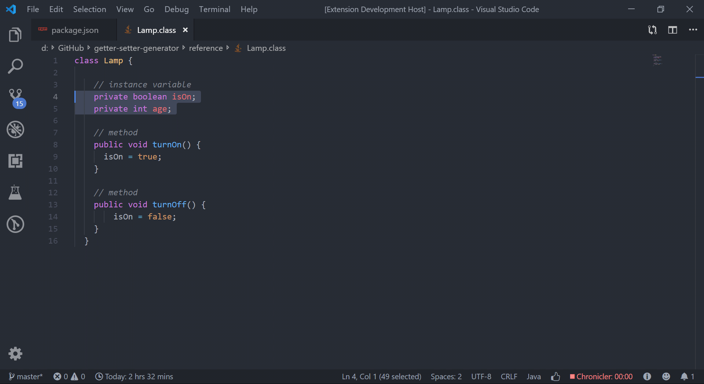

# getter-setter-generator README

This extension generate get and set methods from the class variable declarations.

  - [Features](#features)
    - [Simply call the Extension with `CTRL + ALT + D`](#simply-call-the-extension-with-ctrl--alt--d)
  - [Planned features](#planned-features)
  - [Release Notes](#release-notes)
    - [1.0.0](#100)
  - [Known issues](#known-issues)
  - [Authors and Collaborators](#authors-and-collaborators)
  - [License](#license)
  - [Contribution](#contribution)

## Features

This extension allows you to automatically generate getters and setters with one single command.

* Auto indentation detection. Your code won't break.

### Simply call the Extension with `CTRL + ALT + D`

or just use the Command Palette and search for `Generate Getter/Setter`

## Planned features

- [ ] More Language Support
  - [ ] JavaScript/TypeScript
  - [ ] C++/C#
  - [ ] Python
  - [ ] Go
  - [X] PHP
  - [ ] Ruby
  - [ ] React
- [ ] Customize Code Style
- [ ] Generate Getter/Setter without selection
- [ ] Automatically generate Code Documentation

## Release Notes

### 1.1.0

Added PHP Support
New Known Issue (-> Constructor Variables)

### 1.0.0

Initial release of getter-setter-generator for VS Code

## Known issues

- Make sure whole lines are selected for indentation purposes
- Problems with constructor variables  

## Authors and Collaborators

* Lukas Samir Gabsi

## License
MIT © [Gabsii](https://github.com/Gabsii)

## Contribution
Feel free to send me a PR or an issue to improve the code :)

**Enjoy!**
